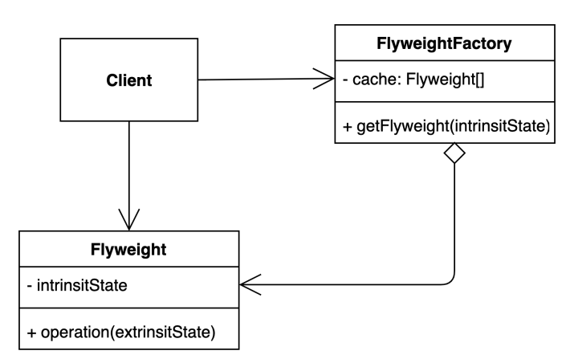
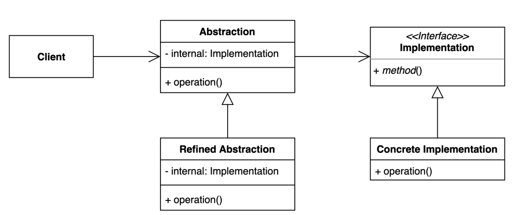

## 아이템 1. 생성자 대신 정적 팩토리 메소드를 고려하라.

### 정적 팩터리 메서드

```java
class ExampleItem() {
    
    public static Boolean valueOf(boolean b) {
        return b ? Boolean.TRUE : Boolean.FALSE;
    }
    
}
````

### 정적 팩터리 메서드 장점
#### 1) 이름을 가질 수 있다.
````
BitInteger(int, int, Random)과 정적 팩터리 메서드인 BigInteger.probablePrime 비교
````
[값이 소수인 BigInteger를 반환한다]는 의미를 더 잘 설명함

#### 2) 호출될 때마다 인스턴스를 새로 생성하지 않아도 된다.
인스턴스를 캐싱하여 재활용하는 식으로 불필요한 객체를 아예 생성을 피할 수 있음

이는 디자인 패턴 중에서 플라이웨이트 패턴*(Flyweight pattern)과 비슷한 기법

- 플라이웨이트 패턴이란?
어떤 클래스의 인스턴스 한 개만 가지고 여러 개의 "가상 인스턴스"를 제공하고 싶을 때 사용하는 패턴
즉, 인스턴스를 가능한 대로 공유시켜 쓸데없이 new 연산자를 통한 메모릴 낭비를 줄이는 방식
자주 사용하는 속성과 자주 사용하지 않는 속성을 분리해서 재사용하는 방식



```java
public class Font {
    final String family;

    final int size;

    public Font(String family, int size) {
        this.family = family;
        this.size = size;
    }

    public int getSize() {
        return size;
    }

    public String getFamily() {
        return family;
    }
}
```

```java
public class FontFactory {

    private Map<String, Font> cache = new HashMap<>();

    public Font getFont(String font) {
        if (cache.containsKey(font)) {
            return cache.get(font);
        } else {
            String[] split = font.split(":");
            Font newFont = new Font(split[0], Integer.parseInt(split[1]));
            cache.put(font, newFont);
            return newFont;
        }

    }
}
```

```java
public class Client {

    public static void main(String[] args) {
        FontFactory fontFactory = new FontFactory();
        Character c1 = new Character('h', "white", fontFactory.getFont("nanum:12"));
        Character c2 = new Character('e', "white", fontFactory.getFont("nanum:12"));
        Character c3 = new Character('l', "white", fontFactory.getFont("nanum:12"));
    }
}
```

#### 3) 반환 타입의 하위 타입 객체를 반환할 수 있는 능력이 있다.
API를 만들때 정적 팩터리 메서드의 반환 타입으로 사용하는 인터페이스를 사용하면 API를 작게 유지함
아이템 20 -> 추상 클래스보다는 인터페이스를 우선하라
```java
public interface Singer{
    AudioClip sing(Song song);
}

public interface Songwriter{
    Song compose(int chartPosition);
}
```
```java
public interface SingerSongwriter extends Singer, Songwriter{
    AudioClip strum();

    void actSensitive();
}
```

자바 8 이전에는 인터페이스에 정적 메서드를 선언할 수 없어서 java.util.Collections에서 정적 팩터리 메서드를 통해 얻도록 했음
하지만 이후에 인터페이스가 제공되면서 컬렉션 프레임워크는 인터페이스만으로 다루게 되어 API가 작아지고 개념적인 무게와 개념의 수와 난이도가 낮아짐
인터페이스가 정적 메서드를 가질 수 없다는 제한이 풀렸기 때문에 인스턴스화 불가 동반 클래스를 둘 이유가 없음


#### 4) 입력 매개변수에 따라 매번 다른 클래스의 객체를 반환할 수 있다.
EnumSet 클래스
원소가 64개 이하면 원소들을 long 변수로 관리하는 RegularEnumSet의 인스턴스
원소가 65개 이상이면 long 배열로 관리하는 JumboEnumSet의 인스턴스를 반환
하지만 클라이언트는 두 클래스의 존재를 모름 

내부적으로 위 기능이 필요 없어서 변경하더라도 클라이언트의 코드는 변화 없음
(일종의 캡슐화, OCP개념을 설명)


#### 5) 정적 팩터리 메서드를 작성하는 시점에는 반환할 객체의 클래스가 존재하지 않아도 된다.
서비스 제공자 프레임워크를 만드는 근간 ex) JDBC
구현체들을 클라이언트에 제공하는 역할을 프레임워크가 통제, 클라이언트 구현체로 부터 분리
(IoC 개념에 대한 설명과 같음)

리플렉션
- 구체적인 클래스 타입을 알지 못하더라도 그 클래스의 메서드, 타입, 변수들에 접근할 수 있도록 해주는 자바 API
- 컴파일 시간이 아닌 실행 시간(런타임)에 동적으로 특정 클래스의 정보를 추출 할 수 있는 프로그래밍 기법
- Intellij 자동완성, 스프링 어노테이션
```java
Class clazz = Child.class;
System.out.println("Class name: " + clazz.getName());

//출력
Class name: test.Child
```
```java
Class clazz2 = Class.forName("test.Child");
System.out.println("Class name: " + clazz2.getName());

//출력
Class name: test.Child
```
```java
Class clazz = Class.forName("test.Child");
Constructor constructors2[] = clazz.getConstructors();
for (Constructor cons : constructors2) {
    System.out.println("Get public constructors in Child: " + cons);
}

//출력
Get public constructors in both Parent and Child: public test.Child()
```

브리지 패턴
추상적인 것과 구체적인 것을 분리하여 연결하는 패턴


의존 객체 주입 프레임워크(DI) -> 결국 스프링 프레임워크


### 정적 팩터리 메서드 단점
#### 1) 상속을 하려면 public이나 protected 생성자가 필요하닌 정적 팩터리 메서드만 제공하면 하위 클래스를 만들 수 없다.
컬렉션 프레임워크의 유틸리티 구현 클래스를 상속할 수 없음을 나타냄
상속(구현상속에 한정적)은 재사용하는 강력한 수단이지만, 항상 최선을 아님, 잘못 사용하면 오류를 내기 쉬운 소프트웨어(아이템 18)
상속을 하지 못하는게 일종의 장점이 될 수 있음

#### 2) 정적 팩터리 메서드는 프로그래머가 찾기 어렵다.
API 설명에 명확히 드러나지 않으니 사용자는 정적 패턱터리 메서드 방식 클래스를 인스턴스화할 방법을 알아내야함

### 정리
#### 정적 팩터리를 사용하는게 유리한 경우가 더 많으므로 무작적 public 생성자를 제공하던 습관이 있다면 고치자.


