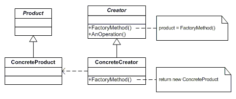

# 아이템 5. 자원을 직접 명시하지 말고 의존 객체 주입을 사용하라.

## 1. 목표
- 인스턴스를 만들지 않는 경우를 권장하는 경우에는 private 생성자를 사용하자.

## 2. 핵심정리
- 사용하는 자원에 따라 동작이 달라지는 클래스는 정적 유틸리티 클래스나 싱글턴 방식이 적합하지 않다.
- 의존 객체 주입이란 인스턴스를 생성할 때 필요한 자원을 넘겨주는 방식이다.
- 이 방식의 변형으로 생성자에 자원 팩터리를 넘겨줄 수 있다.
- 의존 객체 주입을 사용하면 클래스의 유연성, 재사용성, 테스트 용이성을 개선할 수 있다.

## 
### (1) static utils (정적 유틸리티 클래스)
- 사용하는 자원(Dictionary)에 따라 동작이 달라질 수 있어야 한다.
- 그러나, 직접 자원을 생성하는 방식이면 유연하지 않고, 테스트도 작성하기 불편한다.
```java
public class SpellChecker {

  // 사용하는 자원(Dictionary)에 따라 동작이 달라질 수 있어야 한다.
  // 직접 자원을 생성하면 유연하지 않고, 테스트도 작성하기 불편하다.
  private static final Dictionary dictionary = new Dictionary();

  private SpellChecker() {
  }

  public static boolean isValid(String word) {
    // TODO 여기 SpellChecker 코드
    return dictionary.contains(word);
  }

  public static List<String> suggestions(String typo) {
    // TODO 여기 SpellChecker 코드
    return dictionary.closeWordsTo(typo);
  }
}
```

### (2) singleton (싱글톤 클래스)
- 역시 여러 자원(Dictionary)을 사용할 수 없고, 테스트도 작성하기 불편하다.

```java
public class SpellChecker {

  private final Dictionary dictionary = new DefaultDictionary();

  private SpellChecker() {
  }

  public static final SpellChecker INSTANCE = new SpellChecker();

  public boolean isValid(String word) {
    // TODO 여기 SpellChecker 코드
    return dictionary.contains(word);
  }

  public List<String> suggestions(String typo) {
    // TODO 여기 SpellChecker 코드
    return dictionary.closeWordsTo(typo);
  }
}
```

### (3) dependency injection (의존관계 주입)
- 생성자를 통해 사용할 자원을 주입 받는다면, 모든 코드가 재사용될 수 있다.
- 주입받는 객체를 인터페이스로 하면 여러 메서드가 추가,변경 되더라도 재사용이 가능 (규약 O)

```java
public class SpellChecker {

  private final Dictionary dictionary;

  // Dictionary가 인터페이스라면?
  // 생성자를 통해 Dictionary를 주입받으면 모든 코드를 재사용할 수 있다.
  public SpellChecker(Dictionary dictionary) {
    this.dictionary = dictionary;
  }

  public boolean isValid(String word) {
    // TODO 여기 SpellChecker 코드
    return dictionary.contains(word);
  }

  public List<String> suggestions(String typo) {
    // TODO 여기 SpellChecker 코드
    return dictionary.closeWordsTo(typo);
  }
}
```

```java
// 규약이 없는 클래스라면, 메서드가 다를 경우 사용하기 어렵다.
// Interface를 사용해야 재사용이 가능함
public interface Dictionary {

  boolean contains(String word);

  List<String> closeWordsTo(String typo);
}
```

```java
public class DefaultDictionary implements Dictionary{

  @Override
  public boolean contains(String word){
    return false;
  }

  @Override
  public List<String> closeWordsTo(String typo){
    return null;
  }
}
```

## 3. 추가 지식
- p29, 이 패턴의 쓸만한 변형으로 생성자에 자원 팩터리를 넘겨주는 방식이 있다.
- p29, 자바 8에서 소개한 `Supplier<T>` 인터페이스가 팩터리를 표현한 완벽한 예 이다.
- p29, 한정적 와일드카드 타입을 사용해 팩터리의 타입 매개변수를 제한해야한다.
- p29, 팩터리 메서드 패턴
- p30, 의존 객체가 많은 경우에 [Dagger](https://dagger.dev/), [Guice](https://github.com/google/guice), [스프링](https://spring.io/) 같은 의존관계주입 프레임워크 도입을 고려할 수 있다.

### (1) 팩터리 메서드 패턴
구체적으로 어떤 인스턴스를 만들지는 서브 클래스가 정한다.
- 새로운 Product를 제공하는 팩터리를 추가하더라도, 팩터리를 사용하는 클라이언트 코드는 변경할 필요가 없다.


### (2) 스프링 IOC
BeanFactory 또는 ApplicationContext
- Inversion of Control - 제어의 역전
  - 자기 코드에 대한 제어권을 자기 자신이 가지고 있지 않고 외부에서 제어하는 경우
  - 제어권? 인스턴스를 만들거나, 어떤 메서드를 실행하거나, 필요로 하는 의존성을 주입받는 등...
- 스프링 IOC 컨테이너 사용의 장점
  - 수많은 개발자에게 검증되었으며 자바 표준 스팩(`@Inject`)도 지원
  - 손쉽게 싱글톤 Scope를 사용할 수 있다.
  - 객체 생성(Bean) 관련 라이프사이클 인터페이스를 제공한다.