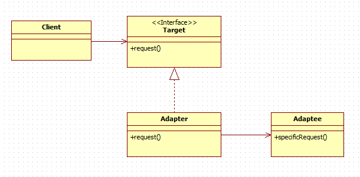

```java
String s = new String("bikini");
```
실행될 때마다 String 인스턴스를 새로 만듬

```java
String s = "bikini";
```
다음 개선된 버전은 인스턴스를 매번 만드는 대신 하나의 String 인스턴스를 사용함

생성자 대신 정적 팩터리 메서드를 제공하는 불변 클래스에서는 정적 팩터리 메서드를 사용해 불필요한 객체 생성을 피함
```java
Boolean(String);

//대신        
Boolean.valueOf(String);
```

### 성능을 훨씬 더 끌어올릴 수 있다!
```java
static boolean isRomanNumeral(String s){
    return s.matches("[정규식]");
}
```

### String.matches는 정규표현식으로 문자열 형태를 확인하는 가장 쉬운 방법이지만, 성능이 중요한 사황에서 반복해 사용하기엔 적합하지 않음

Pattern 인스턴스를 클래스 초기화 과정에서 직접 생성해 캐싱해두고, 나중에 isRomanNumeral 메서드가 호출될 때마다 인스턴스를 재사용

### 값비싼 객체를 재사용해 성능을 개선한다
```java
public class RomanNumerals {
    private static final Pattern ROMAN = Pattern.compile("[정규식]");
    
    static boolean isRomanNumeral(String s){
        return ROMAN.matcher(s).matches();
    }
}
```
1.1ms -> 0.17ms 6.5배 빨라짐
성능만 좋아진 것이 아니라 코드도 더 명확해짐

## 불필요한 객체 생성의 예

### 어댑터 (패턴)
한 클래스의 인터페이스를 클라이언트에서 사용하고자 하는 다른 인터페이스로 변환한다.
어댑터를 이용하면 인터페이스 호환성 문제 때문에 같이 쓸 수 없는 클래스들을 연결해서 씀


어댑터는 뒷단 객체만 관리하면된다. 즉, 뒷단 객체 외에는 관리할 상태가 없으므로 뒷단 객체 하나당 어댑터 하나씩만 만들어지면 충분하다
어댑터를 뷰라고 부름

Map 인터페이스의 keySet 메서드
keySet이 뷰 객체를 여려 개 만들어도 상관은 없지만 그럴 필요도 없고 이득도 없음

오토박싱
기본 타입과 그에 대응하는 박싱된 기본 타입의 구분을 흐려주지만, 완전히 없애주는 것은 아님

### 끔찍이 느리다! 객체가 만들어지는 위치를 찾았는가?
```java
private static long sum(){
    Long sum = 0L;
    for(long i=0; i <= Integer.MAX_VALUE; i++)
        sum += i;
    
    return sum;
}
```

- Long으로 선언해서 불필요한 Long 인스턴스가 약 231개나 만들어진 것
- sum변수의 타입을 long으로만 바꿔주면 내 컴퓨터에서는 6.3초에서 0.59초로 빨라진다.
- 박싱된 기본 타입보다는 기본 타입을 사용하고, 의도치 않은 오토박싱이 숨어들지 않도록 주의하자.

## 정리
- 객체 생성은 비싸니 피해야 한다로만 생각하면 안됨
- 방어적 복사에 실패하면 언제 터져 나올지 모르는 버그와 보안 구멍으로 이어지지만,
- 불필요한 객체 생성은 그저 코드 형태와 성능에만 영향을 줌

### 얕은 복사, 방어적 복사, 깊은 복사
얕은 복사 : 객체를 복사할 때, 객체의 주소 값만을 복사하는 방식
방어적 복사 : 객체의 주소를 복사하지 않고 객체의 내부 값을 참조하여 복사하는 방법
깊은 복사 : 객체의 모든 내부 상태를 완전히 복사하여 새로운 객체를 만드는 방법
