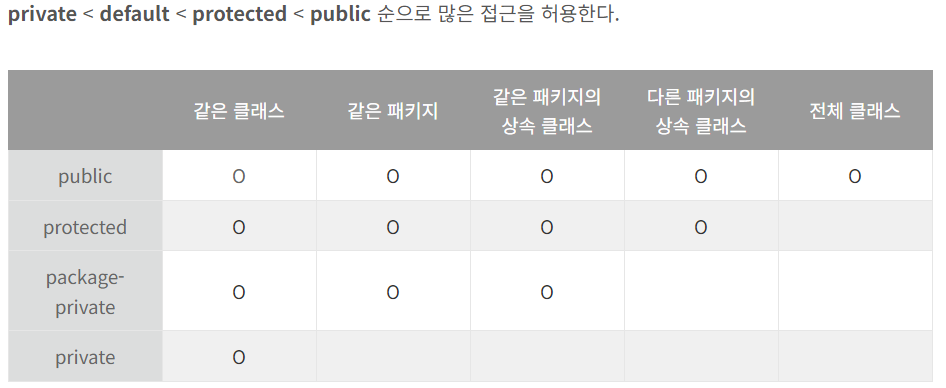

# 클래스와 멤버의 접근 권한을 최소화하라

### 정보 은닉, 혹은 캡슐화라고 하는 이 개념은 소프트웨어 설계의 근간이 되는 원리다
- 개발 속도를 높임, 여러 컴포넌트를 병렬로 개발
- 시스템 관리비용 낮춤, 각 컴포넌트를 더 빨리 파악하여 디버깅할 수 있고, 다른 컴포넌트로 교체하는 부담이 적음
- 정보 은닉 자체가 성능을 높여주지는 않지만, 성능 최적화에도 도움을 줌
- 소프트웨어 재사용성을 높임
- 큰 시스템을 제작하는 난이도를 낮춰줌

### 각 요소의 접근성은 그 요소가 선언된 위치와 접근 제한자(private, protected, public)로 정해진다.이 접근 제한자를 제대로 활용하는것이 정보 은닉의 핵심

### 모든 클래스와 멤버의 접근성을 가능한 한 좁혀야 한다

### 멤버에 부여할 수 있는 접근 수준은 네가지다.
- private : 멤버를 선언한 톱레벨 클래스에서만 접근할 수 있다. 
- package-private : 멤버가 소속된 패키지 안의 모든 클래스에서 접근할 수 있다. 접근 제한자를 명시하지 않았을 때 적용되는 패키지 접근 수준이다.
  (단, 인터페이스의 멤버는 기본적으로 public이 적용된다.)
```java
package user;

public class UserClass {

	private String name;

	String getName() {
		return name;
	}
}

```
```java
package user;

public class OtherClass {

	private final UserClass userClass;

	public OtherClass() {

		this.userClass = new UserClass();
	}
	
	public String getName() {
		return this.userClass.getName();	
	}
}
```
- protected : package-private의 접근 법위를 포함하며, 이 멤버를 선언한 클래스의 하위 클래스에서도 접근할 수 있다. 
- public: 모든 곳에서 접근할 수 있다. 




### 클래스의 공개 API를 세심히 설계한 후, 그 외의 모든 멤버는 private으로 만들자. 그런 다음 오직 같은 패키지의 다른 클래스가 접근해야
### 하는 멤버에 한하여(private 제한자를 제거해) package-private으로 풀어주자.

### public 클래스의 인스턴스 필드는 되도록 public이 아니어야 한다
### public 가변 필드를 갖는 클래스는 일반적으로 스레드 안전하지 않다.

### 클래스에서 public static final 배열 필드를 두거나 이 필드를 반환하는 접근자 메서드를 제공해서는 안된다.
이런 필드나 접근자를 제공한다면 클라이언트에서 그 배열의 내용을 수정할 수 있게됨
### 보안에 허점이 있는 코드 
```java
public static final Thing[] VALUES = {...};
```

### 1. 앞 코드의 public 배열을 private으로 만들고 public 불변 리스트를 추가한다. 
```java
private static final Thing[] PRIVATE_VALUES = { ... };
public static final List<Ting> VALUES = Collections.unmodifiableList(Arrays.asList(PRIVATE_VALUES));
```

### 2. 배열을 private으로 만드록 그 복사본을 반환하는 public 메서드를 추가하는 방법(방어적 복사).
```java
private static final Thing[] PRIVATE_VALUES={...};
public static final Thing[] values(){
    return PRIVATE_VALUES.clone();
        }
```

## 정리
프로그램 요소의 접근성은 가능한 한 최소한으로 해라.  
꼭 필요한 것만 골라 최소한의 public API를 설계해라.  
public 클래스는 상수용 public static final 필드 외에는 어떠한 public 필드도 가져서는 안됨
public static final 필드가 참조하는 객체가 불변인지 확인해라.


