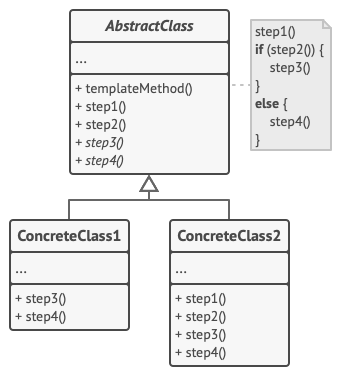
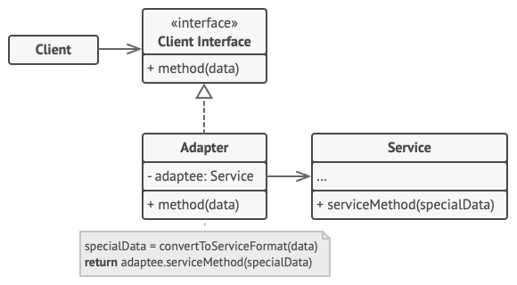

## 추상 클래스보다는 인터페이스를 우선하라

다중 구현 메커니즘은 인터페이스와 추상 클래스임  
둘의 가장 큰 차이는 추상클래스가 정의한 타입을 구현하는 클래스는 반드시 추상 클래스와 하위 클래스가 되어야 함

### 자바 8부터 인터페이스도 디폴트 메서드

## 인터페이스 사용의 장점

### 기존 클래스에도 손쉽게 새로운 인터페이스를 구현해넣을 수 있다
Comparable, Iterable, AutoCloseable 인터페이스가 새로 추가됐을 때 표준 라이브러리의 수많은 기존 클래스가 이 인터페이스들을 구현한 채 릴리스됨  

### 인터페이스는 믹스인(mixin) 정의에 안성맞춤이다.
대상 타입의 주된 기능에 선택적 기능을 '혼합(mixed in)'한다고 해서 믹스인이라고 부름  
하지만, 추상 클래스는 믹스인을 정의할 수 없음

### 인터페이스로는 계층구조가 없는 타입 프레임워크를 만들 수 있음
우리 주변엔 작곡도 하는 가수가 제법 있다.
```java
public interface Singer {
    AudioClip sing(Song song);
}

public interface Songwriter {
    Song compose(int chartPosition);
}
```
새로운 메서드까지 추가한 제3의 인터페이스를 정의할 수 있음
```java
public interface SingerSongwriter extends Singer, Songwriter{
    AudioClip strum();
    void actSensitve();
}
```
위와 같은 코드가 유연성을 주지만 속성이 n개라면 지원해야 할 조합의 수가 2의 n승개가 됨
흔히 조합 폭발(combinato-rial explosion)이라 부른 현상

### 래퍼 클래스 관용구와 함께 사용하면 인터페이스는 기능을 향상시키는 안전하고 강력한 수단이 됨
```java
public final class Integer extends Number implements Comparable<Integer> {
    ...

}
```

### 인터페이스의 메서드 중 구현 방법이 명백한 것이 있다면, 그 구현을 디폴트 메서드로 제공
removeIf 메서드가 하나의 예
### 자바 8의 Collection 인터페이스에 추가된 디폴트 메서드
```java
public interface Collection() {
    
    default boolean removeIf(Predicate<? super E> filter) {
        Objects.requireNonNull(filter);
        boolean result = false;
        for (Iterator<E> it = iterator(); it.hasNext(); ) {
            if (filter.test(it.next())) {
                it.remove();
                result = true;
            }
        }
        return result;

    }
    
}
```
@implSpec 자바독 태그를 붙여 문서화해야 함

## Default 메서드 제약
equals와 hashCode은 Object의 메서드를 정의하고 있지만, 이들은 디폴드 메서드로 제공해서는 안됨

## 골격 구현(skeletal implementation)

### 인터페이스와 추상 골격 구현(skeletal implementation) 클래스를 함께 제공하는 식으로 인터페이스와 추상 클래스의 장점을 모두 취하는 방법도 있음
인터페이스로는 타입을 정의하고, 필요하면 디폴트 메서드 몇 개도 함께 제공

## *템플릿 메서드 패턴
부모 클래스에서 알고리즘의 골격을 정의하지만, 해당 알고리즘의 구조를 변경하지 않고 자식 클래스들이 알고리즘의 특정 단계들을 
오버라이드(재정의) 할 수 있도록 하는 행동 디자인 패턴


기본적으로는 추상클래스를 이용하여 템플릿 메서드 패턴을 구현하지만, 
책에서는 java8에서 제공하는 default메서드와 인터페이스 클래스를 이용하는 것을 추천하고 있음

### 골격 구현을 사용해 완성한 구체 클래스
```java
public class AbstractSkeletalConcreteClass {
    static List<Integer> intArrayAsList(int[] array) {
        Objects.requireNonNull(array);

        return new AbstractList<Integer>() {
            @Override
            public Integer get(final int index) {
                return array[index];
            }

            @Override
            public Integer set(final int index, final Integer element) {
                int oldValue = array[index];
                array[index] = element;
                return oldValue;
            }

            @Override
            public int size() {
                return array.length;
            }
        };
    }
}
```
(List의 기본 기능을 템플릿 메서드로 되어 있고, 추가 기능들을 오버로딩하고 사용한다는 내용 같음)


## *어댑터 패턴
호환되지 않는 인터페이스를 가진 객체들을 협업할 수 있도록 하는 구조적 디자인 패턴



int 배열을 받아 Integer 인스턴스의 리스트 형태로 보여줌(일종의 어댑터)

### 골격 구현 클래스
Map.Entry 인터페이스
```java
public abstract class AbstractMapEntry<K, V> implements Map.Entry<K, V> {

    // 변경 가능한 엔트리는 이 메서드를 반드시 재정의해야 한다.
    @Override
    public V setValue(V value) {
        throw new UnsupportedOperationException();
    }

    // Map.Entry.equals의 일반 규약을 구현한다.
    @Override
    public boolean equals(Object obj) {
        if (obj == this) {
            return true;
        }
        if (!(obj instanceof Map.Entry)) {
            return false;
        }
        Map.Entry<?, ?> e = (Map.Entry) obj;
        return Objects.equals(e.getKey(), getKey()) && Objects.equals(e.getValue(), getValue());
    }

    // Map.Entry.hashCode의 일반 규약을 구현한다.
    @Override
    public int hashCode() {
        return Objects.hashCode(getKey()) ^ Objects.hashCode(getValue());
    }

    @Override
    public String toString() {
        return getKey() + "=" + getValue();
    }
}
```
Map.Entry 인터페이스나 그 하위 인터페이스로는 이 골격 구현을 제공할 수 없다.
디폴트 메서드는 equals, hashCode, toString 같은 Object 메서드를 재정의할 수 없기 때문이다.

인터페이스에 정의한 디폴트 메서드든 별도의 추상 클래스든, 골격 구현은 반드시 그 동작 방식을 잘 정리해 문서로 남겨야함

## 단순 구현(simple implementation)

### 단순 구현(simple implementation)은 골격 구현의 작은 변종으로, Abstract Map.SimpleEntry가 좋은 예
```java
public static class SimpleEntry<K, V> implements Entry<K, V>, java.io.Serializable {
    private static final long serialVersionUID = -8499721149061103585L;

    private final K key;
    private V value;

    /**
     * Creates an entry representing a mapping from the specified
     * key to the specified value.
     *
     * @param key the key represented by this entry
     * @param value the value represented by this entry
     */
    public SimpleEntry(K key, V value) {
        this.key = key;
        this.value = value;
    }

    /**
     * Creates an entry representing the same mapping as the
     * specified entry.
     *
     * @param entry the entry to copy
     */
    public SimpleEntry(Entry<? extends K, ? extends V> entry) {
        this.key = entry.getKey();
        this.value = entry.getValue();
    }

    /**
     * Returns the key corresponding to this entry.
     *
     * @return the key corresponding to this entry
     */
    public K getKey() {
        return key;
    }

    /**
     * Returns the value corresponding to this entry.
     *
     * @return the value corresponding to this entry
     */
    public V getValue() {
        return value;
    }

    /**
     * Replaces the value corresponding to this entry with the specified
     * value.
     *
     * @param value new value to be stored in this entry
     * @return the old value corresponding to the entry
     */
    public V setValue(V value) {
        V oldValue = this.value;
        this.value = value;
        return oldValue;
    }

    /**
     * Compares the specified object with this entry for equality.
     * Returns {@code true} if the given object is also a map entry and
     * the two entries represent the same mapping.  More formally, two
     * entries {@code e1} and {@code e2} represent the same mapping
     * if<pre>
     *   (e1.getKey()==null ?
     *    e2.getKey()==null :
     *    e1.getKey().equals(e2.getKey()))
     *   &amp;&amp;
     *   (e1.getValue()==null ?
     *    e2.getValue()==null :
     *    e1.getValue().equals(e2.getValue()))</pre>
     * This ensures that the {@code equals} method works properly across
     * different implementations of the {@code Map.Entry} interface.
     *
     * @param o object to be compared for equality with this map entry
     * @return {@code true} if the specified object is equal to this map
     *         entry
     * @see    #hashCode
     */
    public boolean equals(Object o) {
        if (!(o instanceof Map.Entry))
            return false;
        Map.Entry<?, ?> e = (Map.Entry<?, ?>) o;
        return eq(key, e.getKey()) && eq(value, e.getValue());
    }

    /**
     * Returns the hash code value for this map entry.  The hash code
     * of a map entry {@code e} is defined to be: <pre>
     *   (e.getKey()==null   ? 0 : e.getKey().hashCode()) ^
     *   (e.getValue()==null ? 0 : e.getValue().hashCode())</pre>
     * This ensures that {@code e1.equals(e2)} implies that
     * {@code e1.hashCode()==e2.hashCode()} for any two Entries
     * {@code e1} and {@code e2}, as required by the general
     * contract of {@link Object#hashCode}.
     *
     * @return the hash code value for this map entry
     * @see    #equals
     */
    public int hashCode() {
        return (key == null ? 0 : key.hashCode()) ^
                (value == null ? 0 : value.hashCode());
    }

    /**
     * Returns a String representation of this map entry.  This
     * implementation returns the string representation of this
     * entry's key followed by the equals character ("{@code =}")
     * followed by the string representation of this entry's value.
     *
     * @return a String representation of this map entry
     */
    public String toString() {
        return key + "=" + value;
    }

}
```
단순 구현도 골격 구현과 같이 상속을 위해 인터페이스를 구현한 것이지만, 추상 클래스가 아니란 점이 다름
쉽게 말하면, 동작하는 가장 단순한 구현

## 정리
### 일반적으로 다중 구현용 타입으로는 인터페이스가 가장 적합
### 복잡한 인터페이스라면 구현하는 수고를 덜어주는 골격 구현을 함께 제공하는 방법을 고려
### 골격 구현은 '가능한 한' 인터페이스의 디폴트 메서드로 제공하여 그 인터페이스를 구현한 모든 곳에서 활용하도록 하는 것이 좋음
### 골격 구현은 인터페이스에 걸려 있는 구현상의 제약 때문에 추상 클래스로 제공하는 경우가 흔함


